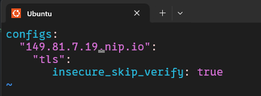
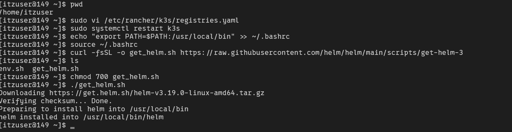
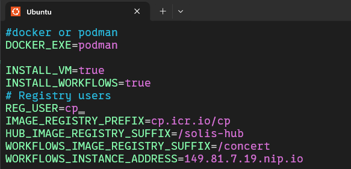

# This is Concert Workflow installation guide

### Prerequisite
- IBM Concert must be installed

---

### Install Concert workflow
1 Access to your VM instance

`ssh -i <your_key_path>/pem_ibmcloudvsi_download.pem itzuser@<your_public_ip> -p <your_ssh_port>`

> ```ssh -i ./pem_ibmcloudvsi_download.pem itzuser@149.81.7.19 -p 2223```

2 Install k3s

```
curl -sfL https://get.k3s.io | sudo INSTALL_K3S_VERSION=v1.33.3+k3s1 sh -s - --write-kubeconfig-mode 644 --disable traefik
```

Specify Kubernetes configurations file

```
echo "export KUBECONFIG=/etc/rancher/k3s/k3s.yaml" >> ~/.bashrc
source ~/.bashrc
```

`sudo vi /etc/rancher/k3s/registries.yaml`

Insert

```
configs:
  "YOUR_VM_PUBLIC_IP.nip.io": 
    "tls": 
       insecure_skip_verify: true
```

Replace **YOUR_VM_PUBLIC_IP** with your vm public ip



save it with :wq, then restart the kubernetes service

`sudo systemctl restart k3s`

---

Next we will
- Add /usr/local/bin in your path
- Install Helm

```
echo "export PATH=$PATH:/usr/local/bin" >> ~/.bashrc
source ~/.bashrc
```

- Download and install helm

```
curl -fsSL -o get_helm.sh https://raw.githubusercontent.com/helm/helm/main/scripts/get-helm-3
chmod 700 get_helm.sh
./get_helm.sh
```



---

## Install Concert workflow

1 Configure Concert workflow parameter file

```
source $HOME/env.sh
cd $INSTALL_DIR
cp $INSTALL_DIR/etc/sample-params/workflows-quickstart-vm-params.ini $INSTALL_DIR/etc/params.ini
```

Edit the file with command

`vim $INSTALL_DIR/etc/params.ini`

Replace **YOUR_VM_PUBLIC_IP** with vm public ip defined in your techzone reservation details

```
DOCKER_EXE=podman

INSTALL_VM=true
INSTALL_WORKFLOWS=true
# Registry users
REG_USER=cp
IMAGE_REGISTRY_PREFIX=cp.icr.io/cp
HUB_IMAGE_REGISTRY_SUFFIX=/solis-hub
WORKFLOWS_IMAGE_REGISTRY_SUFFIX=/concert         
WORKFLOWS_INSTANCE_ADDRESS=YOUR_VM_PUBLIC_IP.nip.io
```



2 Install workflow

- Login to registry 

`${DOCKER_EXE} login ${IBM_REGISTRY} --username=${IBM_REGISTRY_USER} --password=${IBM_REGISTRY_PASSWORD}`

- Install command (Replace the username/password with your own value, I will use ibmconcert as both)

`$INSTALL_DIR/bin/setup --license_acceptance=y --username=<user> --password=<password> --registry_password=${IBM_REGISTRY_PASSWORD}`

> `$INSTALL_DIR/bin/setup --license_acceptance=y --username=ibmconcert --password=ibmconcert --registry_password=${IBM_REGISTRY_PASSWORD}`

- It will take around 20 minutes to install, :D

---

Check Concert Workflow installation

From a browser, enter the URL of your concert instance (https://YOUR_VM_PUBLIC_IP.nip.io/workflows) and log with your concert username and password.

You should have now a Workflows menu on the left burger meny
Navigate to Workflows->Workflows and check that a page is displayed successfully

---

Common issued:
- Error: Kubernetes cluster unreachable: Get "http://localhost:8080/version": dial tcp [::1]:8080: connect: connection refused 2025-10-26 10:08:06 RUNID:1761473285 ERROR: IBM Concert Workflows 2.0.0 helm install command failed with 1 -> make sure you already echo "export KUBECONFIG=/etc/rancher/k3s/k3s.yaml" >> ~/.bashrc
source ~/.bashrc